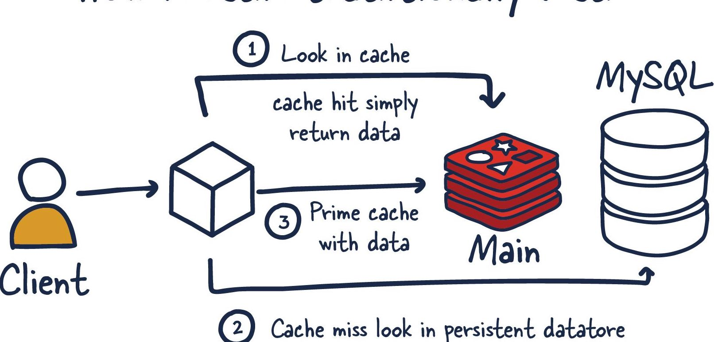

# Description
This repo simulates a database for a soccer team and helps retrive Soccer players information. The user hits an API that checks a redis cache before going to an imaginary MYSQL database or returning the result from the stored cache results.

## Architecture Overview

A HTTP API calls on Redis Cache using REST Controllers. 
## Algorithmic complexity of Cache
All get, put and evict operations from Redis use a O(1+n/k) Time compplexity where `n = number of items` and `k = number of buckets`

## Build and Test
Navigate to the root directory and run
```
make test

```
## Requirements not implemented
Parallel Concurrent Processing - Allocated Time ran out.

Redis Client Protocol - Need more time to research it.

System Tests: Ran it using Postman, Allocated Time ran out.

## Time Spent
HTTP web service : 15mins

Redis Backing Instance and configuration: Spent 6hrs reading documentation on REDIS, SPRING caching and implementing it.

System Tests : 

Single-Click build and test: 1hr


